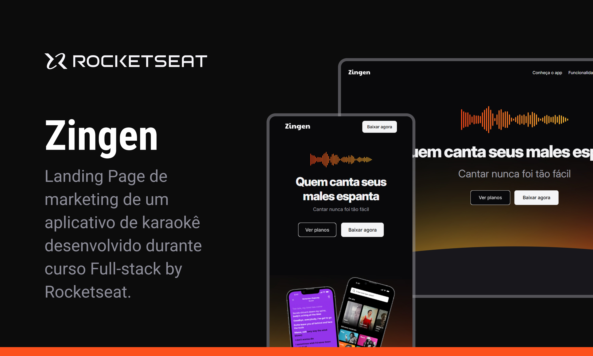

<h1 align="center">Zingen | Karaokê</h1>

Landing Page de marketing completa e responsiva de um aplicativo de karaokê desenvolvido durante curso Full-stack by Rocketseat.

  <a href="#-tecnologias-e-ferramentas">Tecnologias</a>&nbsp;&nbsp;&nbsp;|&nbsp;&nbsp;&nbsp;
  <a href="#-projeto">Projeto</a>&nbsp;&nbsp;&nbsp;|&nbsp;&nbsp;&nbsp;
  <a href="#-layout">Layout</a>&nbsp;&nbsp;&nbsp;|&nbsp;&nbsp;&nbsp;
  <a href="#-licença">Licença</a>

  

 

  

## 🚀 Tecnologias e Ferramentas

Esse projeto foi desenvolvido com as seguintes tecnologias e ferramentas:

## 💻 Projeto

Landing Page de marketing para um aplicativo de karaokê.

- [Acesse o projeto finalizado aqui](https://diegoespelho.github.io/zingen-karaoke-rocketseat/)

## 🔖 Layout

O layout desse projeto foi entregue pela Rocketseat.

## 📝 Licença

Esse projeto está sob a licença MIT.
